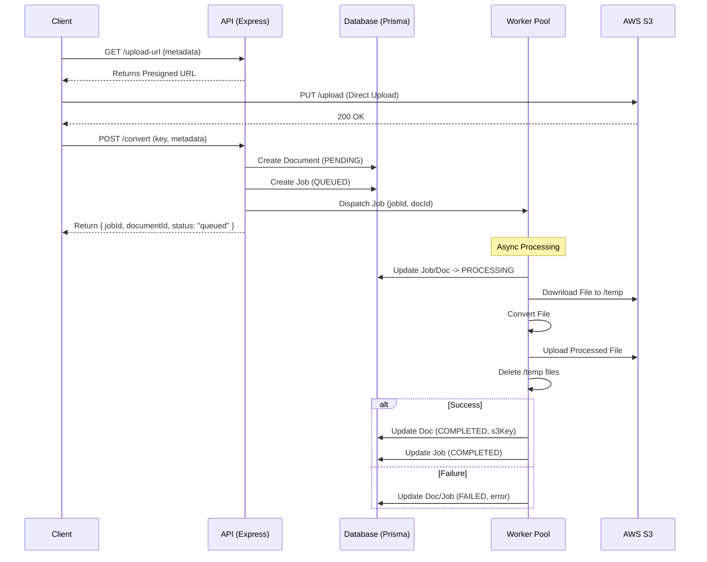

# Conversion Flow & Database Operations

This document outlines the architectural flow for handling file conversions and how to persist these operations in the database using the `Job`, `Document`, and `Image` models.

## 1. High-Level Flow

1.  **Presigned URL Request**: Client requests a presigned URL for uploading.
2.  **Direct Upload**: Client uploads the file directly to S3 using the presigned URL.
3.  **Conversion Request**: Client triggers the conversion endpoint (`POST /convert`) with the S3 key and file metadata.
4.  **Service Layer**:
    - Creates `Document`/`Image` record (PENDING).
    - Creates `Job` record (QUEUED).
    - Dispatches to Worker Pool.
5.  **Worker Pool**:
    - Downloads file from S3 to local `/temp` folder.
    - Processes the file (Convert/Merge/Split).
    - Uploads result to S3.
6.  **Completion**:
    - Updates DB records (COMPLETED).
    - Cleans up local `/temp` file.

## 2. Metadata Extraction (How-To)

### Before Conversion (Conversion Request)

**Where to read this data:** `apps/api/src/controllers/document.controller.ts`

Since the file is uploaded directly to S3 by the frontend, the backend **does not** receive the file in `req.file`. Instead, the frontend must send the metadata in the request body of `POST /convert`.

- **Original Name**: `req.body.originalFileName` (Sent by frontend)
- **Original Format**: `req.body.originalFormat` (Sent by frontend)
- **File Size**: `req.body.fileSize` (Sent by frontend)
- **S3 Key**: `req.body.key` (The key used for the S3 upload)

### Worker Processing (Download & Upload)

The worker needs to download the file first.

1.  **Download**: Worker downloads `s3Key` to `apps/api/temp/input/uuid.ext`.
2.  **Process**: Worker converts `apps/api/temp/input/uuid.ext` to `apps/api/temp/output/uuid.pdf`.
3.  **Upload**: Worker uploads `apps/api/temp/output/uuid.pdf` to S3.
4.  **Cleanup**: Worker deletes local temp files.

### After Conversion (Worker Output)

The worker performs the conversion and has access to the output file buffer or stream.

- **Processed Name**: Usually constructed as `uuid-converted.pdf` (or `targetFormat`).
- **Processed Format**: The `targetFormat` requested (e.g., "pdf").
- **Processed File Size**:
  - If using `Buffer`: `outputBuffer.length`
  - If using `fs`: `fs.statSync(outputPath).size`
- **Processed S3 Key**: The location where the worker uploaded the result (e.g., `processed/uuid-converted.pdf`).

## 3. Database Operations (Step-by-Step)

### Step A: Incoming Request (Service Layer)

**Where to write this code:** `apps/api/src/services/documents/document-services.ts`

The **Controller** (`apps/api/src/controllers/document.controller.ts`) should receive the request and immediately call the **Service**. The **Service** is responsible for creating the initial database records _before_ submitting the job to the worker.

**1. Create Resource Record**
Create a `Document` or `Image` entry to track the file itself.

```typescript
// Example: Creating a Document record
const newDoc = await prisma.document.create({
  data: {
    // 1. Metadata from req.body (Frontend sends this after S3 upload)
    originalFileName: req.body.originalFileName, // "report.docx"
    originalFormat: req.body.originalFormat, // "docx"
    fileSize: req.body.fileSize, // 102400 bytes

    // 2. Conversion Details
    targetFormat: req.body.targetFormat, // "pdf"
    s3Key: req.body.key, // "uploads/uuid-original.docx"
    s3Bucket: process.env.S3_BUCKET,

    status: 'PENDING',
    conversionType: 'FORMAT_CONVERSION',
    userId: userId,
    guestUsageId: guestUsageId,
    expiresAt: new Date(Date.now() + 24 * 60 * 60 * 1000),
    planSnapshot: 'FREE',
  },
});
```

**2. Create Job Record**
Create a `Job` entry to track the background task. This ensures if the server crashes, we know what was running.

**Location:** Same file as above (`apps/api/src/services/documents/document-services.ts`).

```typescript
// Example: Creating a Job record
const newJob = await prisma.job.create({
  data: {
    type: 'DOCUMENT', // or "IMAGE"
    task: 'convert', // or "merge", "split", "resize"
    status: 'QUEUED',
    data: {
      documentId: newDoc.id,
      s3Key: newDoc.s3Key,
      targetFormat: 'pdf',
    },
    userId: userId,
    guestUsageId: guestUsageId,
  },
});
```

### Step B: Worker Execution

**Where to write this code:** `apps/api/src/workers/document.worker.ts`

The worker receives the `jobId` and `documentId`.

**1. Start Processing**
Update status to indicate work has started.

```typescript
await prisma.job.update({
  where: { id: jobId },
  data: { status: 'PROCESSING' },
});

await prisma.document.update({
  where: { id: documentId },
  data: { status: 'PROCESSING', processingStartedAt: new Date() },
});
```

**2. Finish Processing (Success)**
After successful conversion and S3 upload:

```typescript
await prisma.$transaction([
  // Update Document
  prisma.document.update({
    where: { id: documentId },
    data: {
      status: 'COMPLETED',
      // 3. Metadata from Worker Result
      processedS3Key: uploadResult.key, // "processed/uuid-converted.pdf"
      processedFileSize: outputBuffer.length, // 50000 bytes
      processingCompletedAt: new Date(),
    },
  }),
  // Update Job
  prisma.job.update({
    where: { id: jobId },
    data: {
      status: 'COMPLETED',
      result: { success: true, outputKey: 'processed/uuid-converted.pdf' },
    },
  }),
]);
```

**3. Finish Processing (Failure)**
If an error occurs:

```typescript
await prisma.$transaction([
  prisma.document.update({
    where: { id: documentId },
    data: {
      status: 'FAILED',
      processingError: error.message,
    },
  }),
  prisma.job.update({
    where: { id: jobId },
    data: {
      status: 'FAILED',
      error: error.message,
    },
  }),
]);
```

## 4. Detailed Request Flow Diagram



## 5. Key Considerations

- **Transactions**: Use `prisma.$transaction` when updating both `Job` and `Document` statuses simultaneously to ensure consistency.
- **Idempotency**: Ensure workers can handle the same job twice without corruption (e.g., check if status is already COMPLETED).
- **Cleanup**: Implement a cron job to delete old `Job` and `Document` records based on `expiresAt` to save database space.
  - **Suggested Location:** `apps/api/src/cron/cleanup.ts` (New File)
